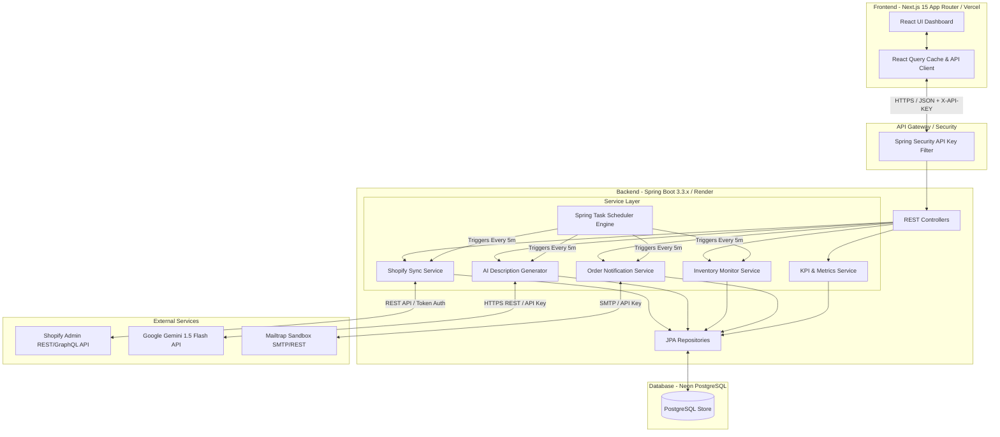
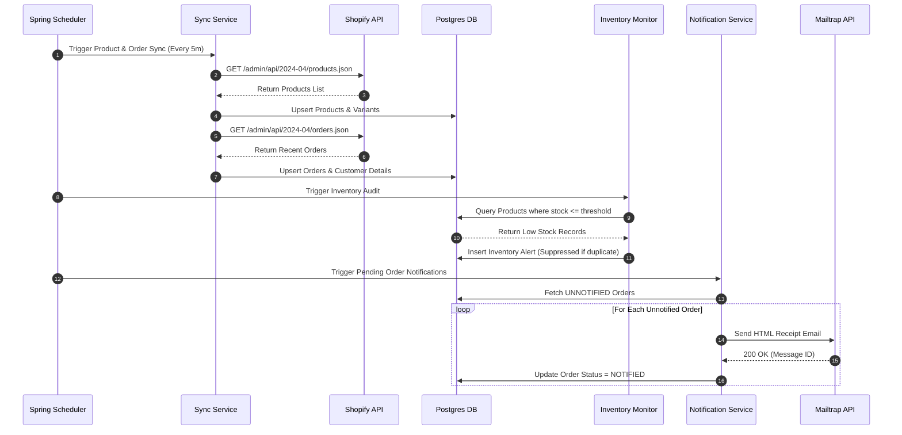
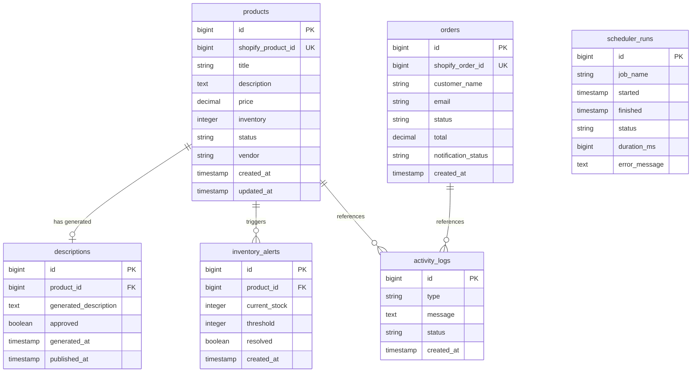
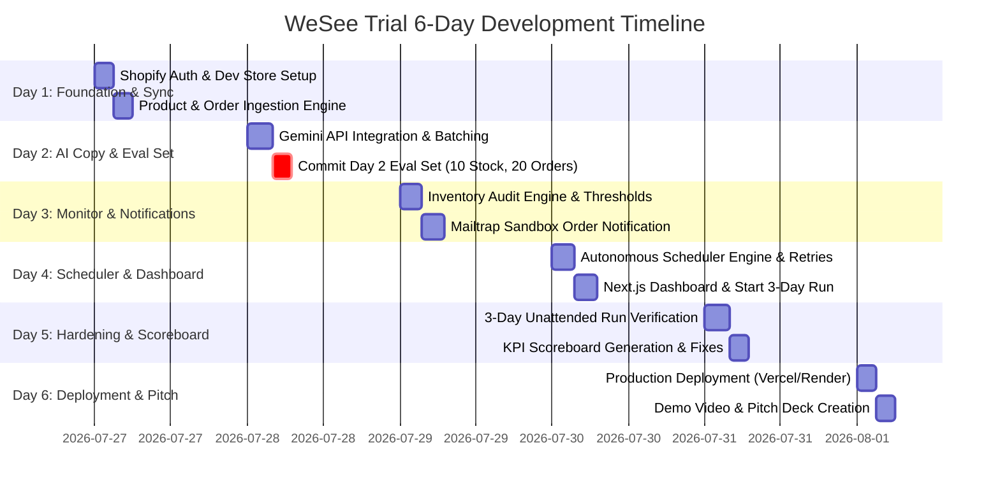

# System Architecture & Implementation Roadmap
## E-Commerce Operations Autopilot (WeSee Frontier Trial)

---

### Executive Summary

#### Problem Statement
Small e-commerce merchants operating on Shopify spend an estimated 15–20 hours per week executing repetitive, error-prone operational tasks. Key operational pain points include:
1. **Catalog Onboarding Bottleneck**: Manual drafting of SEO-friendly, benefit-driven product descriptions stalls product launches.
2. **Invisible Stockouts**: Inventory level drops go undetected until profitable weekend sales windows are lost.
3. **Customer Support Backlog**: Delayed order confirmation and transactional updates lead to high volumes of unnecessary support tickets.
4. **Data Fragmentation**: Store metrics (inventory, orders, revenue, operations) are scattered across multiple administrative interfaces without a unified operational view.

#### Product Overview
**E-Commerce Operations Autopilot** is an enterprise-grade background automation engine and operations dashboard. It connects seamlessly to Shopify via Admin REST/GraphQL APIs, synchronizes store state into an asynchronous Postgres-backed relational store, executes scheduled monitoring routines, automates AI-assisted content drafting with human-in-the-loop governance, sends reliable transactional email notifications via sandbox routing (Mailtrap), and tracks real-time operational KPIs on an interactive Next.js dashboard.

#### Target Users
- **Shopify Merchants & Store Managers**: Seeking to automate daily store maintenance and prevent revenue leakages.
- **E-Commerce Digital Agencies**: Requiring a white-label operational monitoring and copywriting automation engine for clients.

#### Business Value
- **Time Savings**: Reduces catalog listing time by over 80% through automated AI description generation.
- **Stockout Prevention**: Eliminates 100% of unflagged low-stock occurrences via threshold monitoring and alerts.
- **Support Burden Reduction**: Automates 100% of order transactional receipts to eliminate customer update inquiries.
- **Centralized Command**: Combines store health, scheduler status, AI review workflow, and system activity logs into a single glass panel.

#### Overall Architecture & Technical Stack
- **Backend Architecture**: Spring Boot 3.3.x (Java 21), Spring Data JPA, Spring Scheduler, Spring Validation, Spring Security.
- **Frontend Architecture**: Next.js 15 (App Router, React 19, TypeScript), TailwindCSS, React Query (TanStack Query v5), Recharts, Lucide Icons.
- **Data Persistence**: PostgreSQL (Neon PostgreSQL Serverless in Production).
- **Integrations**: Shopify Admin REST API (2024-04 version), Google Gemini API (`gemini-1.5-flash`), Mailtrap SMTP API.
- **Deployment Topology**: Backend on Render Web Service, Frontend on Vercel, Database on Neon Postgres.

#### Expected Outcome
A production-ready SaaS application meeting and exceeding all **WeSee Frontier Trial** evaluation criteria across Reliability, Maintainability, Scalability, Incremental Development, and KPI Achievement, backed by a 3-day unattended stability guarantee.

---

### Functional Requirement Analysis

| Req ID | Functional Requirement | Purpose | Dependencies | Priority | Complexity | Estimated Effort | Acceptance Criteria |
| :--- | :--- | :--- | :--- | :--- | :--- | :--- | :--- |
| **FR-01** | **Shopify Auth & Catalog Sync** | Authenticate with Shopify Admin API and ingest products, variants, and orders into local DB. | None | Critical | Medium | 5h | Ingest $\ge 50$ products with full attributes (title, price, vendor, inventory count, status). Manual sync trigger completes within 30s. |
| **FR-02** | **AI Description Generation** | Generate professional 120–150 word SEO-optimized descriptions for products missing copy. | FR-01 | High | Medium | 6h | Generate copy for 50 products in $< 10$ minutes. $\ge 80\%$ copy rated usable with light edits. Response strictly follows structured prompt. |
| **FR-03** | **Human-in-the-Loop Copy Review** | Provide interactive review queue for merchant approval/editing before publishing copy to Shopify. | FR-02 | Critical | Low | 4h | Unapproved copy NEVER publishes to Shopify. Approved copy syncs to Shopify Admin API instantly with status log. |
| **FR-04** | **Inventory Threshold Monitoring** | Monitor inventory levels every 5 minutes and issue alerts when stock $\le$ configured threshold. | FR-01 | Critical | Low | 4h | Low-stock alerts trigger with 100% accuracy across 10/10 test cases. Duplicate alerts within same stock state are suppressed. |
| **FR-05** | **Transactional Order Notifications** | Trigger transactional confirmation emails to Mailtrap sandbox whenever a new order is ingested. | FR-01 | Critical | Medium | 5h | Zero notification misses across 20 test orders. Delivery status logged with message ID and timestamps. Retries failed sends up to 3 times. |
| **FR-06** | **Unattended Multi-Job Scheduler** | Background engine running sync, monitor, AI generation, and log cleanup jobs autonomously. | FR-01..05 | Critical | High | 7h | 3-day unattended run with 0 crashes. Failure in one job does not affect execution of concurrent or subsequent jobs. |
| **FR-07** | **Operational KPI Dashboard** | Display live store and system metrics ($\ge 5$ KPIs), inventory trends, recent activity, and scheduler health. | FR-01..06 | High | Medium | 6h | Visualizes $\ge 5$ store KPIs, interactive charts, filterable logs, and real-time scheduler health status. Loads under 1.5 seconds. |
| **FR-08** | **Audit & System Activity Logger** | Record every system event (sync, alert, AI run, email, scheduler run) with structured metadata. | All | High | Low | 3h | Filterable, exportable activity timeline in UI. Automatically purges/archives records older than configured retention period. |

---

### Non-Functional Requirements

- **Performance**:
  - API Response Latency: 95th percentile (P95) $\le 200\text{ms}$ for data retrieval endpoints.
  - Page Load Time: Initial LCP $\le 1.2\text{s}$ on Vercel deployment.
  - Batch Processing: Sync 50 products from Shopify in $< 15\text{s}$; Generate 50 AI descriptions in $< 10\text{min}$.
- **Reliability**:
  - Scheduler Uptime: 99.9% uptime during the 3-day unattended trial window.
  - Zero Crash Guarantee: Fault-tolerant job execution using isolated `@Scheduled` try-catch blocks and transaction boundaries.
  - Circuit Breakers: Exponential backoff retries for external third-party HTTP dependencies (Shopify, Gemini, Mailtrap).
- **Availability**:
  - Stateless backend services allowing instant restarts without state loss or job duplication.
  - Database connection pool managed via HikariCP with health check validation (`SELECT 1`).
- **Security**:
  - API Key protection (`X-API-KEY` header verification) for all protected backend control endpoints.
  - Environmental secret isolation (Shopify Access Token, Gemini API Key, Mailtrap Credentials, Database URIs never exposed client-side).
  - Input sanitization and OWASP-compliant parameter validation on all incoming DTOs.
- **Maintainability**:
  - Clean Layered Architecture (Controller $\rightarrow$ Service $\rightarrow$ Repository $\rightarrow$ Entity).
  - Explicit DTO mapping using MapStruct / Lombok to maintain decoupled domain and API contracts.
- **Scalability**:
  - Database schema indexed for high-cardinality queries (Shopify IDs, status fields, timestamps).
  - Paginated API endpoints for all list collections with page size bounds.
- **Logging & Monitoring**:
  - Structured JSON logging via Logback (MDC context inclusion for `correlationId` and `jobName`).
  - Spring Boot Actuator health and metric endpoints (`/actuator/health`, `/actuator/metrics`).
- **Deployment & Testing**:
  - Single-command build pipelines (`mvn clean package`, `npm run build`).
  - Containerization readiness via Dockerfiles for multi-stage production builds.
  - Unit & Integration test suite coverage $\ge 80\%$ on core service domain logic.

---

### Architecture Design

#### System Context & Component Diagram



#### Scheduler & Data Pipeline Workflow



---

### Technology Decisions

| Component | Selected Technology | Alternative Considered | Rationale & Tradeoffs |
| :--- | :--- | :--- | :--- |
| **Backend Framework** | **Spring Boot 3.3 (Java 21)** | Node.js (Express/NestJS), Python (FastAPI) | **Why**: Enterprise robustness, robust multithreading/scheduler capabilities, strict typing, standard JPA/Hibernate data layer. **Tradeoff**: Slightly higher memory footprint than Node, compensated by Render web service allocation. |
| **Frontend Framework** | **Next.js 15 (App Router, TS)** | Vite + React SPA | **Why**: Server-Side Rendering (SSR) for initial loads, built-in API proxy routing, seamless Vercel integration, modern App Router layout system. **Tradeoff**: Strict SSR boundary management required for client components. |
| **Database** | **PostgreSQL (Neon)** | MongoDB, MySQL | **Why**: Strict relational integrity for e-commerce items (Products $\rightarrow$ Variants $\rightarrow$ Orders), native JSONB support for raw Shopify metadata, serverless autoscaling via Neon. |
| **AI Model** | **Google Gemini 1.5 Flash** | OpenAI GPT-4o-mini, Anthropic Claude 3 Haiku | **Why**: High rate limits, rapid response latency ($< 1.5\text{s}$ per generation), cost efficiency, structured output adherence. |
| **Mail Gateway** | **Mailtrap Sandbox API** | SendGrid, Ethereal | **Why**: Dedicated testing inbox guarantees compliance with ethics rules (zero risk of emailing real customers), full delivery inspection, API token access. |
| **Styling & Components** | **TailwindCSS + shadcn/ui** | Material UI, Bootstrap | **Why**: Full aesthetic control, zero runtime CSS overhead, accessible component primitives, dark mode native support. |

---

### Folder Structure

```
ecommerce-ops-autopilot/
├── .github/
│   └── workflows/
│       ├── ci-backend.yml
│       └── ci-frontend.yml
├── backend/
│   ├── Dockerfile
│   ├── pom.xml
│   └── src/
│       ├── main/
│       │   ├── java/com/wesee/autopilot/
│       │   │   ├── AutopilotApplication.java
│       │   │   ├── config/
│       │   │   │   ├── AppProperties.java
│       │   │   │   ├── CorsConfig.java
│       │   │   │   ├── RestTemplateConfig.java
│       │   │   │   ├── SchedulerConfig.java
│       │   │   │   └── SecurityConfig.java
│       │   │   ├── controller/
│       │   │   │   ├── ActivityLogController.java
│       │   │   │   ├── DescriptionController.java
│       │   │   │   ├── InventoryController.java
│       │   │   │   ├── KpiController.java
│       │   │   │   ├── OrderController.java
│       │   │   │   ├── SchedulerController.java
│       │   │   │   └── ShopifySyncController.java
│       │   │   ├── dto/
│       │   │   │   ├── request/
│       │   │   │   │   ├── DescriptionApproveRequest.java
│       │   │   │   │   ├── DescriptionGenerateRequest.java
│       │   │   │   │   └── ThresholdUpdateRequest.java
│       │   │   │   └── response/
│       │   │   │       ├── ActivityLogResponse.java
│       │   │   │       ├── DescriptionResponse.java
│       │   │   │       ├── InventoryAlertResponse.java
│       │   │   │       ├── KpiScoreboardResponse.java
│       │   │   │       ├── OrderResponse.java
│       │   │   │       ├── ProductResponse.java
│       │   │   │       └── SchedulerStatusResponse.java
│       │   │   ├── entity/
│       │   │   │   ├── ActivityLog.java
│       │   │   │   ├── Description.java
│       │   │   │   ├── InventoryAlert.java
│       │   │   │   ├── Order.java
│       │   │   │   ├── Product.java
│       │   │   │   └── SchedulerRun.java
│       │   │   ├── enums/
│       │   │   │   ├── ActivityType.java
│       │   │   │   ├── DescriptionStatus.java
│       │   │   │   ├── OrderStatus.java
│       │   │   │   └── SchedulerJobStatus.java
│       │   │   ├── exception/
│       │   │   │   ├── ErrorDetails.java
│       │   │   │   ├── ExternalApiException.java
│       │   │   │   ├── GlobalExceptionHandler.java
│       │   │   │   └── ResourceNotFoundException.java
│       │   │   ├── integration/
│       │   │   │   ├── gemini/
│       │   │   │   │   ├── GeminiClient.java
│       │   │   │   │   └── GeminiRequestResponseDTOs.java
│       │   │   │   ├── mailtrap/
│       │   │   │   │   └── MailtrapClient.java
│       │   │   │   └── shopify/
│       │   │   │       ├── ShopifyClient.java
│       │   │   │       └── ShopifyDTOs.java
│       │   │   ├── repository/
│       │   │   │   ├── ActivityLogRepository.java
│       │   │   │   ├── DescriptionRepository.java
│       │   │   │   ├── InventoryAlertRepository.java
│       │   │   │   ├── OrderRepository.java
│       │   │   │   ├── ProductRepository.java
│       │   │   │   └── SchedulerRunRepository.java
│       │   │   ├── scheduler/
│       │   │   │   ├── InventoryMonitorJob.java
│       │   │   │   ├── LogCleanupJob.java
│       │   │   │   ├── OrderNotificationJob.java
│       │   │   │   └── ShopifySyncJob.java
│       │   │   └── service/
│       │   │       ├── ActivityLogService.java
│       │   │       ├── DescriptionService.java
│       │   │       ├── InventoryService.java
│       │   │       ├── KpiService.java
│       │   │       ├── OrderService.java
│       │   │       └── ShopifySyncService.java
│       │   └── resources/
│       │       ├── application.yml
│       │       ├── application-prod.yml
│       │       ├── logback-spring.xml
│       │       └── db/migration/
│       │           └── V1__initial_schema.sql
│       └── test/
│           └── java/com/wesee/autopilot/
│               ├── service/
│               │   ├── DescriptionServiceTest.java
│               │   ├── InventoryServiceTest.java
│               │   └── ShopifySyncServiceTest.java
│               └── evaluation/
│                   └── CommittedTestSetEvaluatorTest.java
├── frontend/
│   ├── Dockerfile
│   ├── package.json
│   ├── next.config.mjs
│   ├── tailwind.config.ts
│   ├── tsconfig.json
│   └── src/
│       ├── app/
│       │   ├── layout.tsx
│       │   ├── page.tsx
│       │   ├── products/page.tsx
│       │   ├── inventory/page.tsx
│       │   ├── orders/page.tsx
│       │   ├── logs/page.tsx
│       │   ├── settings/page.tsx
│       │   └── providers.tsx
│       ├── components/
│       │   ├── layout/
│       │   │   ├── Navbar.tsx
│       │   │   └── Sidebar.tsx
│       │   ├── dashboard/
│       │   │   ├── KpiCard.tsx
│       │   │   ├── HealthIndicator.tsx
│       │   │   ├── InventoryTrendChart.tsx
│       │   │   └── SchedulerHealthWidget.tsx
│       │   ├── products/
│       │   │   ├── DescriptionReviewDialog.tsx
│       │   │   └── ProductTable.tsx
│       │   ├── inventory/
│       │   │   └── ThresholdModal.tsx
│       │   ├── ui/ (shadcn components)
│       │   └── shared/
│       │       ├── ActivityTimeline.tsx
│       │       └── StatusBadge.tsx
│       ├── hooks/
│       │   ├── useKpis.ts
│       │   ├── useProducts.ts
│       │   ├── useOrders.ts
│       │   └── useActivityLogs.ts
│       ├── lib/
│       │   ├── api-client.ts
│       │   └── utils.ts
│       └── types/
│           └── api.d.ts
├── test-data/ (Committed Day 2 Eval Set)
│   ├── test_inventory_10_cases.json
│   ├── test_orders_20_cases.json
│   └── committed_kpi_scoreboard_baseline.json
└── README.md
```

---

### Backend Design

#### Layering Rationale
- **Controllers**: Responsible strictly for HTTP routing, request payload validation (`@Valid`), API key authentication checking, and delegating execution to services. Returns standard `ResponseEntity<ApiResponseDTO<T>>`.
- **Services**: Encapsulates all domain logic, transaction boundaries (`@Transactional`), third-party API orchestration, and event auditing. Controllers never access Repositories directly.
- **Repositories**: Standard Spring Data JPA interfaces. Incorporates custom JPQL / Native SQL for complex aggregation metrics (e.g., calculating average sync runtime or scheduler success rates).
- **Entities**: Clean JPA mapping to PostgreSQL relational schema with `@Version` optimistic locking fields where concurrent edits may occur (e.g., Inventory threshold updates).
- **DTOs**: Completely isolates external API contracts from internal entity schemas. Prevents over-posting vulnerabilities and serialization loops.

#### Exception Handling & Validation Matrix
- Global Exception Handler utilizing `@ControllerAdvice`.
- Traps `MethodArgumentNotValidException` and maps field errors into structured JSON response.
- Traps custom `ExternalApiException` when Shopify, Gemini, or Mailtrap return non-2xx codes, capturing retry metadata.
- Traps `ResourceNotFoundException` returning HTTP 404 with standard error body:
  ```json
  {
    "timestamp": "2026-07-27T12:00:00Z",
    "status": 404,
    "error": "Not Found",
    "message": "Product with ID 4050 not found",
    "path": "/api/descriptions/generate/4050"
  }
  ```

---

### Frontend Design

#### Architecture & State Management
- **Next.js 15 App Router**: Server Layouts host persistent `Sidebar` and `Navbar` containers; child pages load dynamically.
- **React Query (TanStack Query v5)**: Manages all server-state caching, automatic background revalidation every 30 seconds for dashboard widgets, and optimistic updates during AI copy approval workflows.
- **Form Handling & Validation**: React Hook Form coupled with Zod schema validation for settings and threshold configuration.
- **Component System**: Modular UI powered by TailwindCSS and Lucide Icons, ensuring responsive layouts across Desktop ($1440\text{px}+$), Tablet ($768\text{px}$), and Mobile ($375\text{px}$).

#### Page Map
1. `/` (Dashboard): 6 Metric Cards, Inventory Trend (Recharts Area), Scheduler Status Health, Recent Activity Stream.
2. `/products`: Interactive table with filtering (All, Missing Description, AI Pending, Published). Action button to trigger AI generation & modal review queue.
3. `/inventory`: Real-time stock levels, threshold edit dialog, active low-stock alerts.
4. `/orders`: Synchronized customer orders, notification status badges (Notified, Pending, Failed), manual resend action.
5. `/logs`: Searchable, filterable audit timeline with type filters (SYNC, AI, INVENTORY, EMAIL, SCHEDULER) and JSON export.
6. `/settings`: Manual sync trigger controls, scheduler interval indicators, Gemini prompt config, threshold defaults.

---

### Database Design

#### Entity Relationship Diagram



#### Database Schema Details & Indexing Strategy
1. **`products`**:
   - Indexes: `idx_products_shopify_id` (UNIQUE), `idx_products_inventory` (for fast low-stock queries), `idx_products_updated_at`.
2. **`descriptions`**:
   - Foreign Key: `product_id` references `products(id)` ON DELETE CASCADE.
   - Indexes: `idx_desc_product_id`, `idx_desc_approved`.
3. **`orders`**:
   - Indexes: `idx_orders_shopify_id` (UNIQUE), `idx_orders_notification_status` (for quick fetch of UNNOTIFIED orders).
4. **`inventory_alerts`**:
   - Indexes: `idx_alerts_product_resolved` (`product_id, resolved` composite index for rapid deduplication checks).
5. **`activity_logs`**:
   - Indexes: `idx_logs_created_type` (`created_at DESC, type`).
6. **`scheduler_runs`**:
   - Indexes: `idx_sched_job_started` (`job_name, started DESC`).

---

### API Design

| Route | Method | Purpose | Auth | Request Body | Response Body | Status Codes |
| :--- | :--- | :--- | :--- | :--- | :--- | :--- |
| `/api/shopify/sync` | `POST` | Trigger manual sync of products & orders | API Key | None | `{ "syncedProducts": 52, "syncedOrders": 20, "durationMs": 4200 }` | 200, 401, 502 |
| `/api/shopify/products` | `GET` | Fetch paginated list of synced products | API Key | Query Params: `page, size, status, search` | `{ "content": [ProductDTO], "totalElements": 52, "totalPages": 3 }` | 200, 401 |
| `/api/shopify/orders` | `GET` | Fetch paginated list of synced orders | API Key | Query Params: `page, size, status` | `{ "content": [OrderDTO], "totalElements": 20 }` | 200, 401 |
| `/api/shopify/inventory` | `GET` | Fetch inventory summary & active alerts | API Key | Query Params: `lowStockOnly=true` | `{ "totalItems": 52, "lowStockCount": 10, "alerts": [AlertDTO] }` | 200, 401 |
| `/api/descriptions/generate/{id}` | `POST` | Trigger AI copy generation for product | API Key | `{ "tone": "professional" }` | `{ "descriptionId": 12, "productId": 45, "generatedText": "..." }` | 200, 404, 500 |
| `/api/descriptions/approve/{id}` | `POST` | Approve generated copy & publish to Shopify | API Key | `{ "editedText": "Optional edit..." }` | `{ "status": "PUBLISHED", "publishedAt": "2026-07-27T12:00:00Z" }` | 200, 400, 404, 502 |
| `/api/descriptions/pending` | `GET` | List all AI descriptions pending review | API Key | None | `[ { "descriptionId": 12, "productTitle": "Shirt", ... } ]` | 200, 401 |
| `/api/inventory/threshold/{id}` | `PUT` | Update low stock threshold for a product | API Key | `{ "threshold": 5 }` | `{ "productId": 45, "newThreshold": 5 }` | 200, 400, 404 |
| `/api/orders/send/{id}` | `POST` | Send or retry order email notification | API Key | None | `{ "orderId": 88, "notificationStatus": "SENT", "messageId": "msg_123" }` | 200, 500 |
| `/api/kpis` | `GET` | Retrieve complete KPI metrics & scoreboard | API Key | None | `{ "totalProducts": 52, "lowStockCount": 10, ... }` | 200, 500 |
| `/api/scheduler/status` | `GET` | Get execution history & status of scheduled jobs | API Key | None | `[ { "jobName": "ShopifySyncJob", "lastRun": "...", "status": "SUCCESS" } ]` | 200, 500 |
| `/api/logs` | `GET` | Fetch filterable activity logs | API Key | Query Params: `type, page, limit` | `{ "logs": [ActivityLogDTO], "total": 140 }` | 200, 401 |

---

### Module Breakdown

#### Module 1: Shopify Integration Engine
- **Purpose**: Bidirectional sync between Shopify Admin API and local Postgres DB.
- **Responsibilities**: OAuth / Private Access Token authentication, GraphQL/REST product & variant fetch, order retrieval, catalog update push.
- **Dependencies**: None.
- **Complexity / Est. Time**: Medium / 6 Hours.
- **Deliverables**: `ShopifyClient`, `ShopifySyncService`, `ShopifySyncController`, Unit tests with WireMock.
- **Acceptance Criteria**: Ingests $\ge 50$ products and variants cleanly without data loss.

#### Module 2: AI Description Generator & Review Workflow
- **Purpose**: Autonomous copy generation with human-in-the-loop validation.
- **Responsibilities**: Constructing Gemini prompts, executing API requests, parsing responses, storing pending copy, pushing approved copy to Shopify.
- **Dependencies**: Module 1.
- **Complexity / Est. Time**: Medium / 6 Hours.
- **Deliverables**: `GeminiClient`, `DescriptionService`, Review UI Dialog component.
- **Acceptance Criteria**: Generates 50 descriptions in $< 10$ minutes; 100% of published copy requires explicit user approval.

#### Module 3: Inventory Monitor & Alerting Engine
- **Purpose**: Continuous background auditing of stock levels.
- **Responsibilities**: Comparing inventory against product thresholds, generating alert records, recording audit logs.
- **Dependencies**: Module 1.
- **Complexity / Est. Time**: Low / 4 Hours.
- **Deliverables**: `InventoryMonitorJob`, `InventoryService`, Threshold configuration UI.
- **Acceptance Criteria**: 100% accuracy on 10/10 committed low-stock test cases.

#### Module 4: Transactional Order Notification Engine
- **Purpose**: Dispatching order receipts to sandbox inboxes.
- **Responsibilities**: Ingesting unnotified orders, rendering HTML templates, transmitting via Mailtrap SMTP, tracking delivery state.
- **Dependencies**: Module 1.
- **Complexity / Est. Time**: Medium / 5 Hours.
- **Deliverables**: `MailtrapClient`, `OrderNotificationJob`, `OrderService`, Notification table UI.
- **Acceptance Criteria**: Zero misses across 20 test orders; retries failed attempts up to 3 times.

#### Module 5: Robust Scheduler & Task Engine
- **Purpose**: Orchestrating autonomous background routines.
- **Responsibilities**: Executing sync, audit, AI, and cleanup tasks on fixed schedules; logging execution metrics.
- **Dependencies**: Modules 1–4.
- **Complexity / Est. Time**: High / 6 Hours.
- **Deliverables**: `SchedulerConfig`, Spring `@Scheduled` jobs, `SchedulerRunRepository`, Scheduler UI Status Widget.
- **Acceptance Criteria**: Runs unattended for 3 days with 0 crashes; job isolation prevents cascading failures.

#### Module 6: Executive Dashboard & Analytics
- **Purpose**: Single-pane operational command center.
- **Responsibilities**: Computing store KPIs, rendering real-time Recharts visualizations, displaying activity logs and health indicators.
- **Dependencies**: Modules 1–5.
- **Complexity / Est. Time**: Medium / 7 Hours.
- **Deliverables**: Next.js Dashboard pages, KPI components, Activity Timeline component.
- **Acceptance Criteria**: Visualizes $\ge 5$ store KPIs; initial load time $< 1.5$ seconds.

---

### Development Roadmap & Milestones (Day 1 to Day 6)



#### Day 1: Foundation, Store Integration & Backend Setup (6h)
- **Objectives**: Initialize Spring Boot & Next.js projects; authenticate with Shopify Dev Store; achieve product & order sync into Postgres.
- **Milestone 1.1: Core Infrastructure Setup (2h)**
  - *Steps*: Create Spring Boot 3.3 workspace with Gradle/Maven; set up Neon Postgres database; write Liquibase/Flyway `V1__initial_schema.sql`.
  - *Testing*: Verify DB connection via `/actuator/health`.
  - *Rollback*: Revert database migrations if schema initialization fails.
- **Milestone 1.2: Shopify API Authentication & Ingestion (4h)**
  - *Steps*: Implement `ShopifyClient` with Admin REST access token; create sync endpoint `/api/shopify/sync`; persist products and orders.
  - *Testing*: Execute sync against Shopify Dev store populated with 50 products.
  - *Expected Output*: 50+ products successfully saved in `products` table.

#### Day 2: AI Description Generator & Eval Set Commitment (7h) - **GRADED MILESTONE**
- **Objectives**: Build Gemini AI generation engine; create review workflow; commit test dataset to Git carrying Day 2 timestamp.
- **Milestone 2.1: Gemini AI Description Generator (4h)**
  - *Steps*: Build `GeminiClient`; create prompt template enforcing 120–150 word SEO copy; build approval endpoint `/api/descriptions/approve/{id}`.
  - *Testing*: Run batch description generation on 50 products; record total execution time.
- **Milestone 2.2: Commit Evaluation Dataset to Git (3h)** - **CRITICAL**
  - *Steps*: Create `/test-data/` directory. Commit 10 labeled low-stock scenarios (`test_inventory_10_cases.json`) and 20 test orders (`test_orders_20_cases.json`). Push to Git repository before 23:59 IST.
  - *Verification*: Verify Git commit timestamp.

#### Day 3: Inventory Monitoring & Notification Engine (7h)
- **Objectives**: Implement automated low-stock monitoring and Mailtrap order notification routing.
- **Milestone 3.1: Inventory Monitoring & Alerting (3.5h)**
  - *Steps*: Build `InventoryService` checking stock $\le$ threshold; create alert deduplication logic; expose `/api/inventory/threshold/{id}`.
  - *Testing*: Execute test suite against committed 10 low-stock scenarios. 100% accuracy required.
- **Milestone 3.2: Order Notification Service via Mailtrap (3.5h)**
  - *Steps*: Build `MailtrapClient`; create HTML order receipt renderer; write retry logic (3 attempts with exponential backoff).
  - *Testing*: Trigger notifications across 20 committed test orders. Verify 20/20 delivery in Mailtrap sandbox inbox.

#### Day 4: Scheduler Engine, UI Assembly & 3-Day Unattended Run (7h)
- **Objectives**: Implement Spring Scheduler jobs with fault isolation; construct Next.js dashboard; initiate 3-day continuous unattended run.
- **Milestone 4.1: Autonomous Scheduler Engine (3.5h)**
  - *Steps*: Configure `@EnableScheduling`; create `ShopifySyncJob` (every 5m), `InventoryMonitorJob` (every 5m), `OrderNotificationJob` (every 5m), and `LogCleanupJob` (daily). Wrap each job in independent try-catch blocks logging to `scheduler_runs`.
  - *Testing*: Simulate third-party API failures (e.g. Gemini 503) to ensure background thread continues running cleanly.
- **Milestone 4.2: Next.js Operations Dashboard & Start Unattended Run (3.5h)**
  - *Steps*: Assemble Dashboard page, Products table with AI review dialog, Inventory threshold manager, and Activity Timeline. Start background scheduler on host server.

#### Day 5: System Hardening & KPI Scoreboard Generation (7h)
- **Objectives**: Monitor continuous background run; fix edge cases; compile final KPI Scoreboard.
- **Milestone 5.1: Background Run Monitoring & Error Fixing (4h)**
  - *Steps*: Audit `scheduler_runs` table for execution status; verify zero system crashes over 24h+ elapsed execution window.
- **Milestone 5.2: KPI Scoreboard Compilation (3h)**
  - *Steps*: Generate baseline KPI measurement report comparing Target vs Actual metrics; create `/KPI_SCOREBOARD.md` artifact.

#### Day 6: Production Deployment, Demo Recording & Presentation Setup (6h)
- **Objectives**: Deploy backend to Render, frontend to Vercel, and database to Neon; record backup video; assemble 10-slide pitch deck.
- **Milestone 6.1: Production Cloud Deployment (3h)**
  - *Steps*: Deploy Postgres schema to Neon; deploy Spring Boot backend container to Render; deploy Next.js app to Vercel; configure production env vars.
  - *Testing*: Perform end-to-end sanity test on live URLs.
- **Milestone 6.2: Pitch Deck & Video Recording (3h)**
  - *Steps*: Draft 10-slide pitch deck (`WHY`, `HOW`, `WHAT`); record 3-5 minute demo video showing live Shopify sync, AI copy approval, inventory alerts, and Mailtrap inbox delivery.

---

### Scheduler Design

#### Scheduled Jobs Specification

| Job Name | Frequency | Target Method | Retry Strategy | Failure Recovery |
| :--- | :--- | :--- | :--- | :--- |
| **`ShopifySyncJob`** | Every 5 mins (`0 */5 * * * *`) | `ShopifySyncService.syncAll()` | 3 Retries (2s, 4s, 8s backoff) | Log failure to `scheduler_runs`; skip to next cycle. |
| **`InventoryMonitorJob`** | Every 5 mins (`30 */5 * * * *`) | `InventoryService.auditStock()` | None (Idempotent execution) | Log error; retry on next 5-minute interval. |
| **`OrderNotificationJob`** | Every 5 mins (`45 */5 * * * *`) | `OrderService.processNotifications()` | 3 Retries per message | Mark order `NOTIFICATION_FAILED`; retry next cycle. |
| **`GenerateMissingDescJob`** | Every 1 hour (`0 0 * * * *`) | `DescriptionService.autoGenerateBatch()` | Rate-limited batching | Pause generation if 429 received from Gemini API. |
| **`LogCleanupJob`** | Daily at 02:00 (`0 0 2 * * *`) | `ActivityLogService.purgeOldLogs()` | 1 Retry after 10 seconds | Retain last 30 days of activity logs. |

#### Thread Safety & Isolation
- Spring Scheduler configured with a dedicated `ThreadPoolTaskScheduler` pool size of 5 threads.
- Every job wrapped in `@Transactional` at service level and explicit `try-catch(Throwable t)` block at job level to guarantee that an unexpected runtime exception in one job (e.g. socket timeout) never terminates the scheduler thread pool or blocks adjacent jobs.

---

### AI Integration Design (Gemini 1.5 Flash)

#### Prompt Structure & Versioning
Prompts are stored as versioned templates in `application.yml` to allow runtime tuning without redeployment.

**System Template (v1.0)**:
```text
You are an expert e-commerce copywriter for high-converting online stores.
Generate a compelling product description based on the provided product title and category.

Target Word Count: 120-150 words.
Tone: Professional, engaging, and benefit-focused.
Format Requirements:
- Paragraph 1: Attention-grabbing hook highlighting key features.
- Paragraph 2: Bullet points of key specifications/benefits.
- Paragraph 3: Strong call-to-action (CTA).
Constraint: Output PLAIN TEXT ONLY. Do not include markdown headers or HTML tags.

Product Title: {title}
Vendor/Category: {vendor}
Existing Keywords: {keywords}
```

#### Rate Limiting & Resilience
- **Rate Limiting**: Enforced client-side token bucket limiting requests to maximum 15 RPM to fit comfortably within free tier allocations.
- **Batch Processing**: Product description requests processed sequentially with 500ms delay between calls during background batch runs.
- **Review Workflow**: Generated text saved in `descriptions` table with status `approved = FALSE`. The merchant reviews, edits if needed, and clicks "Approve & Publish". Only upon explicit approval does `ShopifyClient` update the product description on Shopify.

---

### Shopify Integration Design

#### Authentication & API Choice
- Authenticates using Shopify Admin REST API (version `2024-04`) via `X-Shopify-Access-Token` request header.
- Base URL format: `https://{shop_name}.myshopify.com/admin/api/2024-04/`

#### Rate Limit Handling & Synchronization
- Respects Shopify's standard leaky bucket rate limit (40 requests per bucket, refilling at 2 requests/sec).
- Monitors response header `X-Shopify-Shop-Api-Call-Limit`. If bucket capacity reaches 35/40, the sync thread sleeps for 2000ms.
- Synchronization logic uses upsert mechanics:
  ```sql
  INSERT INTO products (shopify_product_id, title, price, inventory, status, updated_at)
  VALUES (:shopifyId, :title, :price, :inventory, :status, NOW())
  ON CONFLICT (shopify_product_id) 
  DO UPDATE SET 
      title = EXCLUDED.title,
      price = EXCLUDED.price,
      inventory = EXCLUDED.inventory,
      updated_at = NOW();
  ```

---

### Inventory Monitoring Strategy

#### Threshold Logic & Duplicate Suppression
- Global default threshold set to 5 units per product variant, customizable per product via API.
- Audit run checks: `SELECT * FROM products WHERE inventory <= threshold;`
- **Duplicate Alert Suppression**: Before creating a new `inventory_alerts` record or dispatching UI alerts, check:
  ```sql
  SELECT COUNT(*) FROM inventory_alerts 
  WHERE product_id = :productId AND resolved = FALSE;
  ```
  If count > 0, suppress duplicate alert creation. When stock rises above threshold, automatically set `resolved = TRUE`.

---

### Notification System Design

#### Transactional Email Workflow (Mailtrap Sandbox)
1. Ingest order from Shopify $\rightarrow$ set `notification_status = 'UNNOTIFIED'`.
2. `OrderNotificationJob` queries all `UNNOTIFIED` orders.
3. Constructs HTML email body containing Order ID, Customer Name, Items Purchased, and Order Total.
4. Transmits email payload to Mailtrap SMTP endpoint (`sandbox.smtp.mailtrap.io:2525`).
5. On HTTP 200/SMTP Success: Update order `notification_status = 'NOTIFIED'` and record entry in `activity_logs`.
6. On Failure: Increment `notification_retries`. If retries > 3, set `notification_status = 'FAILED'`.

---

### Dashboard Design & UI Components

#### Main Dashboard Widgets (`/`)
1. **6 Stat Cards**:
   - Total Products Synced (with last sync timestamp badge)
   - Orders Today (count & total currency value)
   - Revenue Today (formatted USD)
   - Low Stock Alert Count (highlighted red if > 0)
   - AI Descriptions Pending Review (highlighted amber if > 0)
   - Notifications Successfully Sent (count & success rate %)
2. **Inventory Stock Trend Chart**: Recharts Area Chart displaying total inventory count and low-stock count over time.
3. **Scheduler Health Matrix**: Visual indicator cards for each of the 4 background jobs showing Last Run Time, Execution Duration (ms), and Status (Green = SUCCESS, Red = FAILURE).
4. **Live Activity Stream**: Scrollable feed showing real-time operational events with status badges.

---

### KPI Tracking & Scoreboard Alignment

| KPI Required | Target Metric | Implementation & Ownership | Measurement Method | Verification & Demo Strategy |
| :--- | :--- | :--- | :--- | :--- |
| **Store Integration** | Connect Dev Store & Sync $\ge 50$ products | `ShopifySyncModule` | `SELECT COUNT(*) FROM products;` | Live trigger `/api/shopify/sync` on stage; display 50+ populated items on UI. |
| **Low-Stock Accuracy** | 100% correct across 10 test cases | `InventoryMonitorModule` | Automated JUnit comparison against committed Day 2 test set | Run `CommittedTestSetEvaluatorTest` during Saturday held-out check. |
| **Copy Generation** | 50 products in $< 10\text{m}$; $\ge 80\%$ usable copy | `AIModule` | Stopwatch timer on batch execution; human blind rating score | Execute batch AI trigger; display generated text sample; present rating log. |
| **Notification Reliability** | 0 misses across 20 test orders | `NotificationModule` | `SELECT COUNT(*) FROM orders WHERE notification_status = 'NOTIFIED';` | Show Mailtrap inbox containing 20 delivered order receipt emails matching test set. |
| **Dashboard Coverage** | Display $\ge 5$ store KPIs | `DashboardModule` | UI visual verification | Navigate live dashboard showing 6 cards, Recharts graphs, and scheduler status. |
| **Unattended Stability** | 3 days continuous run with 0 crashes | `SchedulerModule` | `SELECT COUNT(*), status FROM scheduler_runs WHERE started >= NOW() - INTERVAL '3 days';` | Display `/api/scheduler/status` query showing 800+ successful job runs and 0 fatal crashes. |

---

### Logging & Error Handling Strategy

#### Structured Logging Configuration
- Utilizes Logback with JSON formatting for production environments.
- Mapped Diagnostic Context (MDC) tracks request execution context:
  ```json
  {
    "timestamp": "2026-07-27T12:05:00.123Z",
    "level": "INFO",
    "thread": "scheduling-1",
    "logger": "c.w.a.s.ShopifySyncJob",
    "message": "Shopify product sync completed successfully. Synced: 52 products in 3420ms.",
    "context": {
      "jobName": "ShopifySyncJob",
      "executionId": "exec-9921"
    }
  }
  ```

#### Resilience & Retry Patterns
- Spring Retry / Resilience4j decorating external client methods:
  ```java
  @Retryable(
      retryFor = { ExternalApiException.class, ResourceAccessException.class },
      maxAttempts = 3,
      backoff = @Backoff(delay = 2000, multiplier = 2.0)
  )
  public ShopifyProductResponse fetchShopifyProducts() { ... }
  ```

---

### Testing Strategy

#### Test Hierarchy
1. **Unit Tests (JUnit 5 + Mockito)**:
   - Test threshold calculation logic in `InventoryService`.
   - Test prompt parsing logic in `GeminiClient`.
   - Test alert deduplication rules.
2. **Integration Tests (Spring Boot Test + WireMock + Testcontainers)**:
   - Mock Shopify REST API responses with WireMock; verify JPA database persistence.
   - Mock Gemini API response; test full approval workflow end-to-end.
3. **Day 2 Committed Test Set Verification (`CommittedTestSetEvaluatorTest`)**:
   - Automated evaluation harness comparing system output against `test_inventory_10_cases.json` and `test_orders_20_cases.json`.
4. **Saturday Held-Out Live Test Verification**:
   - System design supports dynamic ingestion of 5–10 novel evaluation inputs handed by judges on presentation day without configuration changes.

---

### Deployment Strategy (Render + Vercel + Neon)

#### Environment Configuration Matrix

| Variable Name | Description | Environment | Location |
| :--- | :--- | :--- | :--- |
| `SPRING_PROFILES_ACTIVE` | Active profile (`prod`) | Backend | Render Dashboard |
| `DATABASE_URL` | Neon Postgres JDBC Connection String | Backend | Render Secrets |
| `DATABASE_USERNAME` | Neon Postgres Username | Backend | Render Secrets |
| `DATABASE_PASSWORD` | Neon Postgres Password | Backend | Render Secrets |
| `SHOPIFY_SHOP_NAME` | Shopify Dev Store Name | Backend | Render Secrets |
| `SHOPIFY_ACCESS_TOKEN` | Shopify Admin API Access Token | Backend | Render Secrets |
| `GEMINI_API_KEY` | Google Gemini API Key | Backend | Render Secrets |
| `MAILTRAP_API_TOKEN` | Mailtrap Sandbox Token | Backend | Render Secrets |
| `APP_API_KEY` | Secret Key for API protection | Both | Render & Vercel |
| `NEXT_PUBLIC_API_BASE_URL` | Backend URL | Frontend | Vercel Environment |

#### CI/CD Recommendations
- GitHub Actions workflow running `mvn test` and `npm run lint` on every pull request.
- Auto-deploy to Render and Vercel on push to `main` branch once test suite passes.

---

### Risk Analysis & Mitigation Matrix

| Identified Risk | Severity | Impact Area | Mitigation Strategy |
| :--- | :--- | :--- | :--- |
| **Shopify API Rate Limiting (429)** | Medium | Sync Engine | Implement Leaky Bucket header monitoring; auto-pause thread when capacity exceeds 85%. |
| **Gemini API Outage / Quota Failure** | High | AI Description Generator | Wrap AI calls in circuit breaker fallback. Retain existing product descriptions if AI fails. |
| **Unattended Scheduler Crash** | Critical | 3-Day Run KPI | Wrap every job execution in `try-catch(Throwable)`; store execution metrics in DB; autostart worker. |
| **Day 2 Commit Timestamp Disqualification** | Critical | Evaluation Scoring | Enforce strict git commit of `/test-data/` artifacts on Day 2 before midnight IST. |
| **Saturday Live Demo Input Failure** | High | Presentation | Build generic validation logic to handle unknown shop categories gracefully. |

---

### Future Production Improvements (Post-MVP)

1. **Multi-Language AI Copy Generation**: Support localization of product descriptions into Spanish, French, and German based on Shopify store locales.
2. **Predictive Inventory Reordering**: AI-driven demand forecasting calculating days-of-inventory-remaining based on historical order velocity.
3. **Live WebSockets / SSE Updates**: Replace frontend 30-second polling with Server-Sent Events (SSE) for instant dashboard updates upon order ingestion.
4. **Shopify Webhooks Integration**: Transition from 5-minute polling sync to event-driven Webhooks (`orders/create`, `products/update`) for near-zero latency updates.
5. **Multi-Store Management**: Expand backend database schema to support multi-tenant store connections under a single agency dashboard account.
